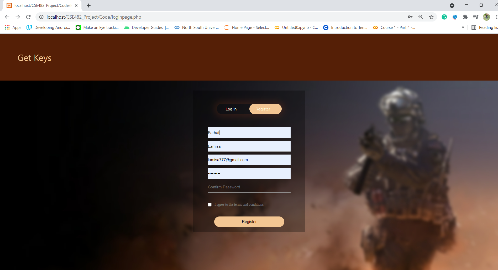
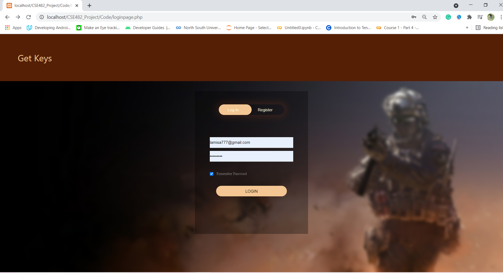
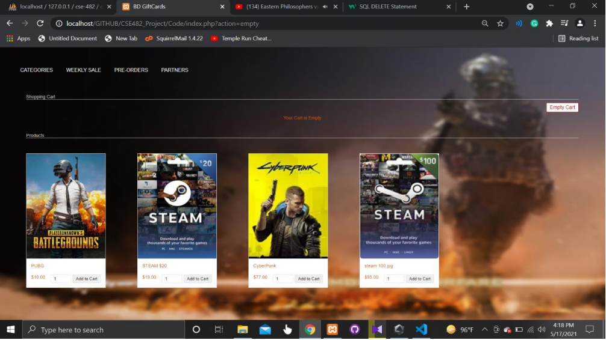
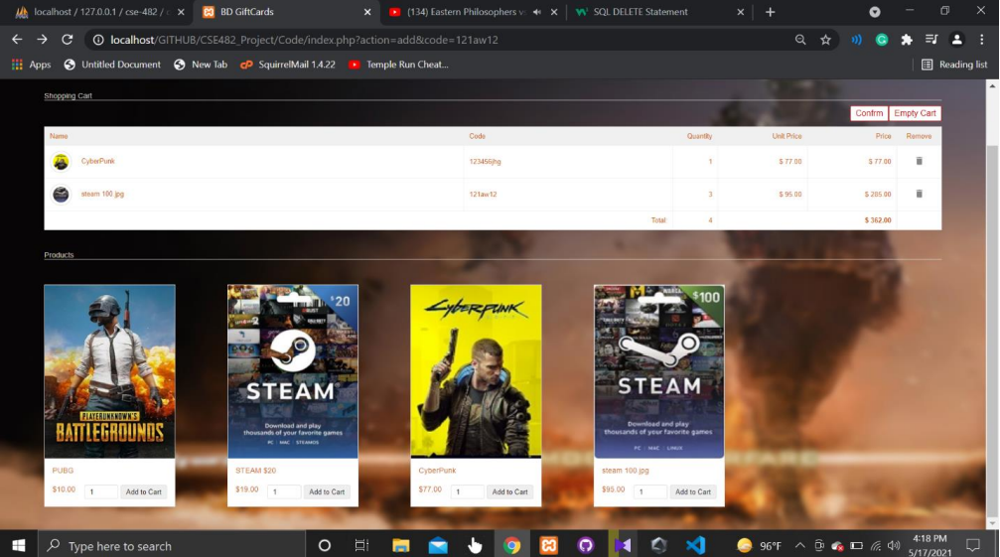
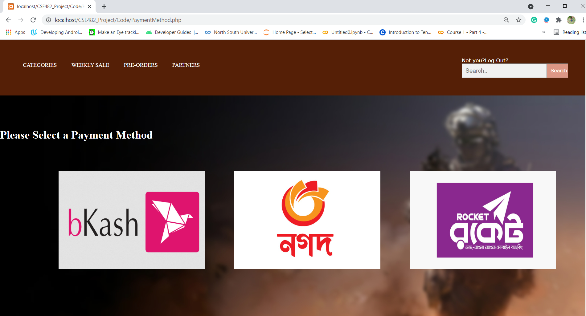
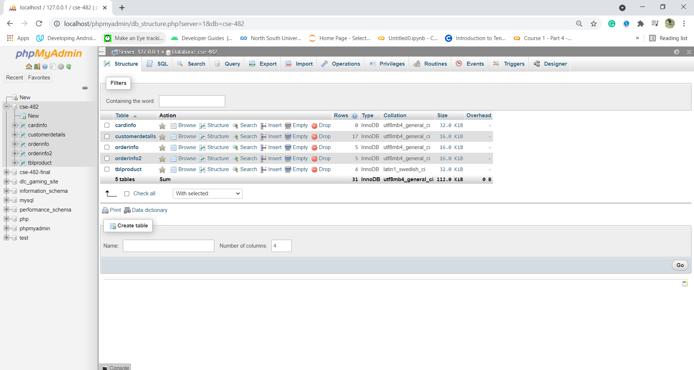

&nbsp;

&nbsp;

<strong></strong>

<strong>North South University</strong>

Department of Electrical &amp; Computer Engineering

<strong>Project Report</strong>

<strong>Spring 2021</strong>

<strong>Project Name</strong>: Game Subscription Based Website

<strong>Course No</strong>: CSE 482 <strong>Sec</strong><strong>:</strong> 2

<strong><u>Member 1</u></strong><u>:</u>

<strong>Name</strong><strong>:</strong> Rahman Farhat Lamisa

<strong>ID</strong><strong>:&nbsp; </strong>1731068042

<strong>Email</strong><strong>:</strong> <a href="mailto:lamisa.farhat@northsouth.edu">lamisa.farhat@northsouth.edu</a>

<strong><u>Member 2</u></strong><u>:</u>

<strong>Name</strong><strong>:</strong> Md. Rownak Islam Dip

<strong>ID</strong><strong>:&nbsp; </strong>1731068042

<strong>Email</strong><strong>:</strong> <a href="mailto:lamisa.farhat@northsouth.edu">rownak.pip@northsouth.edu</a>

<strong><u>Member 3</u></strong><u>:</u>

<strong>Name</strong><strong>:</strong> Md. Rownak Islam Dip

<strong>ID</strong><strong>:&nbsp; </strong>1731448642

<strong>Email</strong><strong>:</strong> <a href="mailto:lamisa.farhat@northsouth.edu">nishat.tabassum173@northsouth.edu</a>

<strong>Date Prepared</strong><strong>: </strong>16/03/2021

<strong>&nbsp;</strong>

<strong>&nbsp;</strong>

<h2> Project Name: Game Subscription Based Website </h2>
<h3 id="table-of-contents">Table of contents</h3>

<ol>
  <a href="#description"><li>Project Description</li> </a>
  <a href="#features"><li>Features</li> </a>
  <a href="#database"><li>Database</li> </a>
</ol>

<h2 id="description">1. Project Description</h2>

The name of the Project is Game Subscription Based Website. The main purpose of our Project is to sell 
gift cards and subscription in a simpler way to our native people in Bangladesh. Our main customers will 
be our fellow gamers around the country. They will be able to purchase the gift cards and game related 
other subscriptions easily from our website using the usual payment methods which are available to 
everyone in our country. The main functions of our Website include sign up/log in options. The user can 
easily Register and create an account using our Register/Login page. Later he can use that information to 
Login to our Website and browse our available subscriptions that we offer. The user information will be 
stored in our main Database as well. 

More functions include shopping cart system in our Website. That is, the user can choose the items that 
he wants and it will be added in the cart for the total payment. And finally, he can choose from three 
available payment options to pay for his checkout. 

&nbsp;

<h2 id="features">2. Features</h2>
This project has the following features -
<h3>2.1 User Registration:</h3>
  This is the main log in page of our website where the user can log in using his information that he provided while his registration.
    
    
 

    
   Figure 1.0
 

 
 <h3>2.2 User Login :</h3>
  This is the main Register page of our website where the user can enter his information and Sign up in our website.
   
   
  

   
  Figure 2.0

<h3>2.3  View Items :</h3>
 This is the main Homepage of our website where the user can view our offered subscriptions/items and add to his cart.

 
 
 

    
   Figure 3.0
 

 
<h3>2.4 Cart :</h3>
This is the cart system of our webpage where all the chosen items/subscriptions will be added to the cart for the final payment.
 
 
 

    
   Figure 4.0
 

 
 <h3>2.5 Payment Method :</h3>
 This is the final page of our website where the user will make his purchase using the given payment methods
 
 
 

    
   Figure 5.0
 
  
 
 <h2 id="database">3. Database</h2>
 We used SQL for our database
 

    
   Figure 6.0
 

&nbsp;
